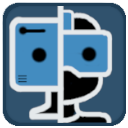
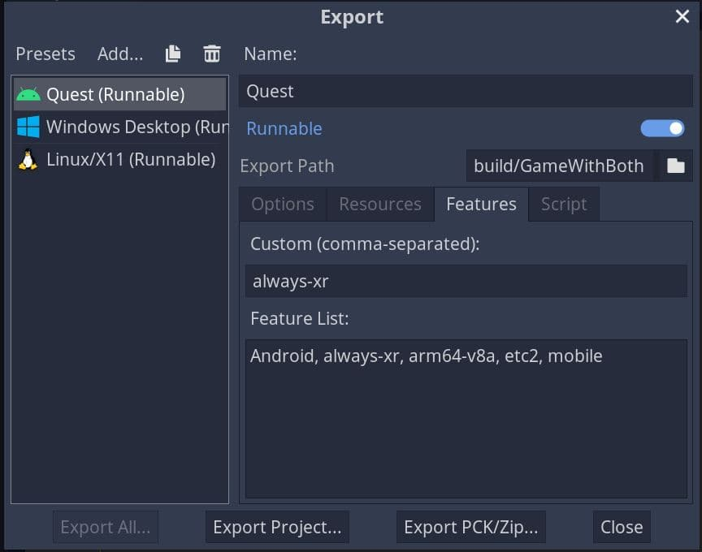

# Godot Example that Supports Both Flat & XR

Get you a project template that can do both (XR and 'normal' 3D game).

This project example is using Godot 3.5.1

## Autoload Singleton

There is one singleton to define under the "AutoLoad" section. the script "xr_or_flat_mode_singleton.gd" must be named "XrOrFlatMode". This singleton is the helper that allows any script to preform functions that differ between modes and to query the current mode.

## Providing Launch Options in Launcher App

This is intended to be used with itch.io's ["Manifest actions"](https://itch.io/docs/itch/integrating/manifest-actions.html) feature, where one can create different ways to launch a game. 

## Enforce XR Mode For Quest

Simply add the "always-xr" feature to the android export.

Don't forget to setup the usual settings like "XR Mode" as "OpenXR".

## Autodetect
If no OS feature is enforcing a mode, or the in-engine selector, it will select a mode based on whether it can start in XR mode or not.

## Specify Mode via argument

  * Use "--flat", "--flat=true", or "--xr=false" for standard flat mode.
  * Use "--xr" or "--xr=true" for XR mode.
